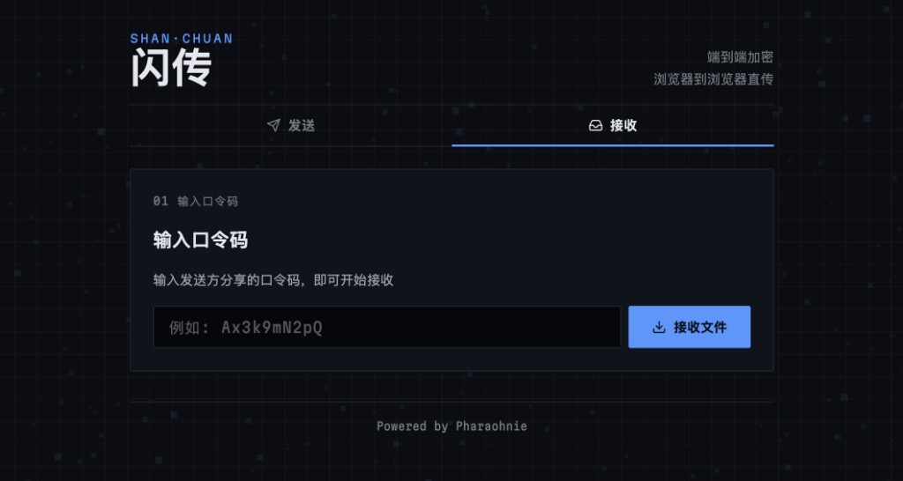

# 闪传（Croc-WASM）

浏览器端到端加密文件传输工具。发送方与接收方通过口令配对，数据经 PAKE 协商密钥后 AES-GCM 加密传输；优先尝试 WebRTC 点对点直连，不可用时自动降级到中继转发。



## 功能特点

- **端到端加密**：PAKE 口令认证 + AES-GCM 加密，中继服务器无法解密文件内容
- **口令与房间 ID 解耦**：加入房间时发送口令哈希，降低口令明文暴露面
- **智能传输路径**：自动检测 STUN 连通性，优先 P2P 直连，失败时回退 WebSocket 中继
- **多文件与文本**：支持拖拽多选文件、纯文本发送；接收方可流式下载大文件
- **零账号**：无需注册登录，分享口令即可传输
- **安全加固**：限流防暴力枚举、CSP 安全头、文件名消毒、AAD 绑定防篡改、公网 `ws://` 明文拦截

## 环境要求

| 依赖 | 版本 |
|------|------|
| [Go](https://go.dev/dl/) | 1.26+ |
| [Node.js](https://nodejs.org/) | 18+（仅运行测试时需要） |

## 快速开始

### 1. 克隆仓库

```bash
git clone <repo-url> croc-wasm
cd croc-wasm
```

### 2. 构建

```bash
./build.sh
```

构建产物：

- `relay/relay-server` — WebSocket 中继服务（同时托管前端静态资源）
- `public/croc.wasm` — Go 编译的加密 WASM 模块
- `public/wasm_exec.js` — Go WASM 运行时

### 3. 启动服务

```bash
cd relay && ./relay-server
```

默认监听 `http://localhost:8154`，在浏览器打开该地址即可使用。

配置文件位于项目根目录 `config.yaml`，中继启动时会自动查找。也可手动指定：

```bash
./relay-server -config ../config.yaml
```

### 4. 使用流程

**发送方**

1. 点击「发送」，选择文件或输入文本
2. 点击「开始发送」，复制生成的口令码
3. 将口令码分享给接收方，等待传输完成

**接收方**

1. 点击「接收」，输入发送方分享的口令码
2. 点击「接收文件」，等待下载或查看文本

## 配置说明

编辑 `config.yaml` 可调整监听地址、CORS/WebSocket Origin 白名单、房间上限、限流阈值、CSP 策略等。生产部署时请注意：

- 将 `cors.allowed_origins` 与 `websocket.allowed_origins` 改为实际前端域名
- 使用 HTTPS/WSS（前置反向代理或 TLS 终止）
- 按需设置 `client.relay_url` 为完整的 `wss://` 地址

## 测试

```bash
# 前端安全与传输策略
node --test tests/*.test.mjs

# 中继服务
go test ./relay/...
```

## 项目结构

```
croc-wasm/
├── docs/            # 文档与截图
├── public/          # 前端静态资源（HTML / JS / CSS / WASM）
├── relay/           # Go WebSocket 中继服务
├── wasm/            # Go WASM 加密模块（PAKE + AES-GCM）
├── tests/           # Node.js 单元测试
├── config.yaml      # 中继服务配置
└── build.sh         # 一键构建脚本
```

